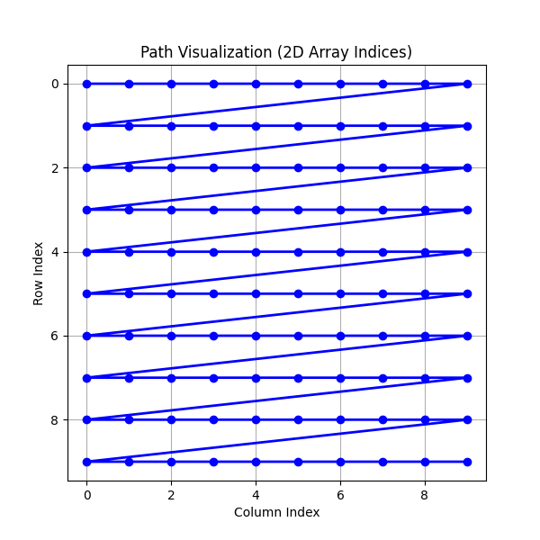
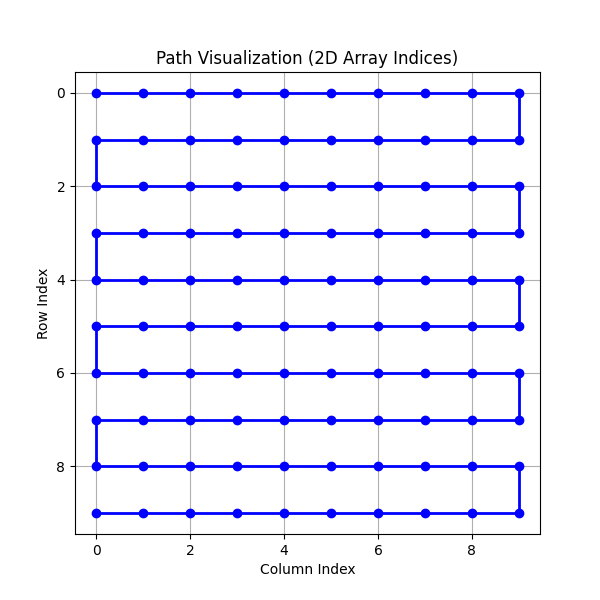
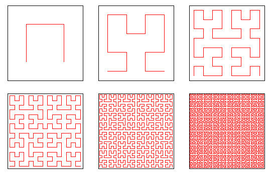
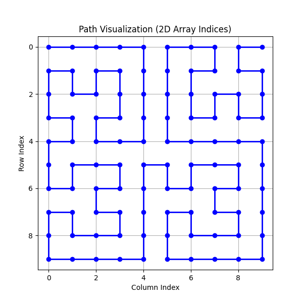

# Fractal-Based Image Flattening for Neural Networks

A from-scratch implementation of a distance-preserving dimensionality reduction method using a custom recursive fractal curve, validated on the MNIST dataset with a zero-dependency machine learning engine.

---

## Project Overview
This project explores the intersection of **Pure Mathematics** and **Machine Learning**. The MNIST dataset is a classic dataset for testing deep-learning models, however there is one challenge traditional Feed-Forward Neural Networks face: dimension reduction. Since traditional Neural networks need a vector as input, the image must be flattened.

Every flattening algorithm can be visualized with a space-filling curve since you are arranging every given pixel into a traditional array. For example, a traditional flattening algorithm which just stacks rows next to each other becomes a "Z" shaped curve like seen below:

<p align="center">
  
</p>

This kind of curve actually destroys many of the spatial relationships our algorithm seeks to learn because it does not preserve **spatial locality**. That is, points that are close together in the image become far apart in the final vector. This motivates us to find a more advanced flattening algorithm.

One simple approach is to change the shape of this curve to an "S", to avoid the discontinuous jumps that happen at the end of a row. 

<p align="center">
  
</p>

While this is an improvement, it is not optimal because the points that are in different rows end up far apart even if close together in the original image. 

The most effective option is usually a special mathematical curve known as the **Hilbert curve**. It is a special fractal space-filling curve that is generated using a recursive algorithm that pieces together "U" shaped segments. it looks something like: 

<p align="center">
  
</p>

However, there is a critical issue. This curve will not work on the 10x10 example that I gave above for the Z and S curves. The nature of the recursive algorithm mandates that the input image must be of dimension $2^n \times 2^n$. This is rarely the case in the real world, even for MNIST the images are natively 28x28. Trimming and resizing will often reduce the quality of the samples and limit the ability to extract important features

To solve this problem, I designed and implemented an **L-shaped block augmentation** method that allows recursive fractal generation for square images of any integer dimension. This eliminates the need for data-distorting preprocessing steps like trimming or interpolation for datasets comprized of input samples whose dimensions are not a power of two. Here is an example on a 10x10 grid:

<p align="center">
  
</p>

## Key Features
* **Recursive Fractal Mapping:** Custom coordinate mapping logic in `fractal_flatten.py` that generalizes the Hilbert curve properties to arbitrary square dimensions.
* **From-Scratch ML Engine:** A Feed-forward Neural Network implemented entirely in **NumPy**, featuring manual backpropagation and linear algebra handling.
* **Convergence Guaranteed:** Mathematical proof that the recursive dimension reduction function $f(x)$ covers all pixels for an image of any square dimension $n \in \mathbb{N}$. See /docs/proof_of_convergence.pdf for the formal proof of this fact
* **Optimized Training:** Stochastic Gradient Descent (SGD) with **exponentially decreasing step sizes**.
* **High Efficiency:** Achieved **99.3% test accuracy** and **0.9993 AUC** on MNIST with fewer than **250,000 parameters**.

## Getting Started

1. Ensure you have python 3.8+ on your machine 
2. clone this repo 
```
git clone https://github.com/Akshatkkumar/MNIST_with_flattening.git
cd MNIST_with_flattening
```
3. Create a virtual environment(Depends on your OS). 

On Windows
```
python -m venv venv
.\venv\Scripts\activate
```
On MacOS/Linux
```
python3 -m venv venv
source venv/bin/activate
```

4. install the necessary requirements 
```
pip install -r requirements.txt
```
5. Run the test code
```
python -m scripts.main
```


## Technical Stack
| Category | Tools |
| :--- | :--- |
| **Languages** | Python (NumPy, sklearn.datasets, PIL, ast) |
| **Core Logic** | Linear Algebra, Recursive Algorithms, Multi-variate Calculus |
| **Architecture** | Custom Feed-Forward NN with Fractal Flattening Layer |

## Repository Structure
* `core/fractal_flatten.py`: The fractal-curve generation and coordinate mapping logic.
* `core/NN_architecture.py`: Neural network architecture, backpropagation, and SGD implementation.
* `core/train_model.py`: Data loading and preprocessing utilities along with training and saving a new model's parameters in a .npz file
* `docs/proof_of_convergence.pdf`: Formal mathematical proof of the algorithm's ability to create a mapping for all image sizes.

## Results
Despite the compact parameter count, the model demonstrates high spatial awareness due to the distance-preserving nature of the fractal curve:
* **Accuracy:** 99.3% 
* **AUC:** 0.9993
* **Parameter Count:** < 400,000
* **Optimization:** Manual hyperparameter tuning via training cycle observation.

---
*Developed as part of an exploration into beyond-standard Hilbert curves and high-performance dimensionality reduction.*
